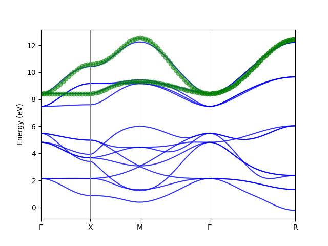

# Tutorial 

## Installation

#### Prerequists:

- python > 3.6 are supported.  Other versions of python 3 might work but are not tested. 

#### Install

First we download and uncompress the package.

to install, we can use pip, the dependencies will be aromatically downloaded and installed.

```bash
cd <your_package_path>
pip install .
```

#### Uninstall

```
pip uninstall minimulti
```


### Usage:

Below is an example of how to use downfold an tight-binding Hamiltonian from Wannier90 output. 

We need to write a python script (e.g. downfold.py) to call the Downfolder. I'll explain the code line by line.

The W90 Hamiltonian is the spin down part for an SrMn$O_3$. The orginal wannier functions consist the O $2p$ and Mn $3d$ orbitals. We want to downfold the Hamiltonian to a two band Mn $e_g$ model.  

```python
from banddownfolder import W90Downfolder
import numpy as np


def main():
    # Read From Wannier90 output
    # The w90 output
    model = W90Downfolder(folder='./SMO_Wannier/',
                          prefix='abinito_w90_down')

    # Downfold the band structure.
    model.downfold(method='scdmk',
                   kmesh=(3, 3, 3),
                   nwann=2,
                   weight_func='Gauss',
                   mu=10.0,
                   sigma=3.0,
                   selected_basis=None,
                   anchors={(0, 0, 0): (12, 13)},
                   use_proj=True,
                   write_hr_nc='Downfolded_hr.nc',
                   write_hr_txt='Downfolded_hr.txt')

    # Plot the band structure.
    model.plot_band_fitting(kvectors=np.array([[0, 0, 0], [0.5, 0, 0],
                                               [0.5, 0.5, 0], [0, 0, 0],
                                               [.5, .5, .5]]),
                            knames=['$\Gamma$', 'X', 'M', '$\Gamma$', 'R'],
                            supercell_matrix=None,
                            npoints=100,
                            efermi=None,
                            erange=None,
                            fullband_color='blue',
                            downfolded_band_color='green',
                            marker='o',
                            ax=None,
                            savefig='Downfolded_band.png',
                            show=True)


if __name__ == "__main__":
    main()

```

After running the script, we get the output of Wannier functions (in Downfolded_hr.txt and Downfolded_hr.nc) and the band structures of the orginal/downfolded Wannier functions as below.



* Now we dig into the example script, we first import the module W90Downfolder:

  ```python
  from banddownfolder.downfolder import W90Downfolder
  import numpy as np
  ```

* Next we read the Wannier90 output, which is in the folder directory and the prefix of these outputs. Note that the W90 Hamiltonian file has a _hr in the prefix and we do not need to specify this.

  ```
  model = W90Downfolder(folder='./SMO_Wannier/',
                            prefix='abinito_w90_down')
  ```

* Next we can do the downfolding. 

  - The method is first performed for each k-point in a BZ, and the
  - There are two methods implemented: the scdm-k method and the projected Wannier function method. Both use the same set of parameters.  The parameters are below. 

  - There are two methods to specify the Wannier functions we need to build. First is that we can give some anchor points, e.g. the band with index 12 and 13 at $\Gamma$, given as {(0,0,0):(12,13)}. 

    The second method is we could select the basis from the original Wannier functions. E.g. in this example we could select the two $e_g$ orbitals of Mn.  Only one of the two method should be used. The  parameter for the non-used one should be set to None.

  - In addition to the anchor points or the selected_basis, a energy weight function can be specified to indicate where the band we need are located, given by the parameters weight_func, mu, and sigma. 

  ​	==Note==: All the indices are zero-based. 

  - We use a strategy to select the band by projecting to the anchor points. It can improve the disentanglement significantly if the energy weight function is not obvious. By setting use_proj to True we can enable it. 
  - The Hamiltonian can be outputted to txt and netcdf file. The latter is strongly recommended. But if the netcdf library is not easy to install in your environment, the txt file is also a good choice. By setting the parameter to None, the output is dis-activated. 

```

        Downfold the Band structure.
        The method first get the eigenvalues and eigenvectors in a Monkhorst-Pack grid from the model.
        It then use the scdm-k or the projected wannier function method to downfold the Hamiltonian at each k-point.
        And finally it Fourier transform the new basis functions(Wannier functions) from k-space to real space.
        The Hamiltonian can be written.

        Parameters:
        ====================================
        method:  the method of downfolding. scdmk|projected
        kmesh,   The k-mesh used for the BZ sampling. e.g. (5, 5, 5)
                 Note that for the moment, only odd number should be used so that the mesh is Gamma centered.
        nwann,   Number of Wannier functions to be constructed. 
        weight_func,   # The weight function type. 'unity', 'Gauss', 'Fermi', or 'window'
         - unity: all the bands are equally weighted.
         - Gauss: A gaussian centered at mu, and has the half width of sigma.
         - Fermi: A fermi function. The Fermi energy is mu, and the smearing is sigma.
         - window: A window function in the range of (mu, sigma)
        mu: see above
        sigma: see above
        selected_basis, A list of the indexes of the Wannier functions as initial guess. The number should be equal to nwann.
        anchors: Anchor points. The index of band at one k-point. e.g.(0, 0, 0): (6, 7, 8)
        use_proj: Whether to use projection to the anchor points in the weight function.
        write_hr_nc: write the Hamiltonian into a netcdf file. It require the NETCDF4 python library. use write_nc=None if not needed.
        write_hr_txt: write the Hamiltonian into a txt file.

```

* After we get the downfolded model, we can compare the band structures to see if we get a reasonable result. 

  ```
  model.plot_band_fitting(kvectors=np.array([[0, 0, 0], [0.5, 0, 0],
                                                 [0.5, 0.5, 0], [0, 0, 0],
                                                 [.5, .5, .5]]),
                              knames=['$\Gamma$', 'X', 'M', '$\Gamma$', 'R'],
                              supercell_matrix=None,
                              npoints=100,
                              efermi=None,
                              erange=None,
                              fullband_color='blue',
                              downfolded_band_color='green',
                              marker='o',
                              ax=None,
                              savefig='Downfolded_band.png',
                              show=True)
  ```

  The documeation of the parameters is below:

  ```
          Parameters:
          ========================================
          kvectors: coordinates of special k-points
          knames: names of special k-points
          supercell_matrix: If the structure is a supercell, the band can be in the primitive cell.
          npoints: number of k-points in the band.
          efermi: Fermi energy.
          erange: range of energy to be shown. e.g. [-5,5]
          fullband_color: the color of the full band structure.
          downfolded_band_color: the color of the downfolded band structure.
          marker: the marker of the downfolded band structure.
          ax: matplotlib axes object.
          savefig: the filename of the figure to be saved.
          show: whether to show the band structure.
  
  ```

  

### Output

* Downfolded_Hr.txt file:

  The Hamiltonian is outputed to a txt file. The hamiltonian is in real space, given in the form of $H(i,j,R)$.  There are interactions between orbitals in the neighboring unitcells, threrefore we need a $R$ vector to specify the cells of the orbital $j$.   $H(i,j,R)$ is the hopping term between the $i$th Wannier function in the original cell and the $j$th Wannier function in the cell. The on-site energy for orbital $i$ is  H(i,i,R=(0,0,0))  The header of the file contains the number of the cells (Number of R). The number of Wannier functions in the downfolded model. 

  In the Hamiltonian, the H(i,j, R) are grouped by the $R$ vectors.

```
Number_of_R: 27
Number_of_Wannier_functions: 2
Hamiltonian:
============================================================
index of R: 0.  R = [-1 -1 -1]
R = [-1 -1 -1], i = 0, j=0 :: H(i,j,R)= 0.0036+0.0000j
R = [-1 -1 -1], i = 0, j=1 :: H(i,j,R)= -0.0000-0.0000j
R = [-1 -1 -1], i = 1, j=0 :: H(i,j,R)= -0.0000+0.0000j
R = [-1 -1 -1], i = 1, j=1 :: H(i,j,R)= 0.0036+0.0000j
------------------------------------------------------------
....
```


